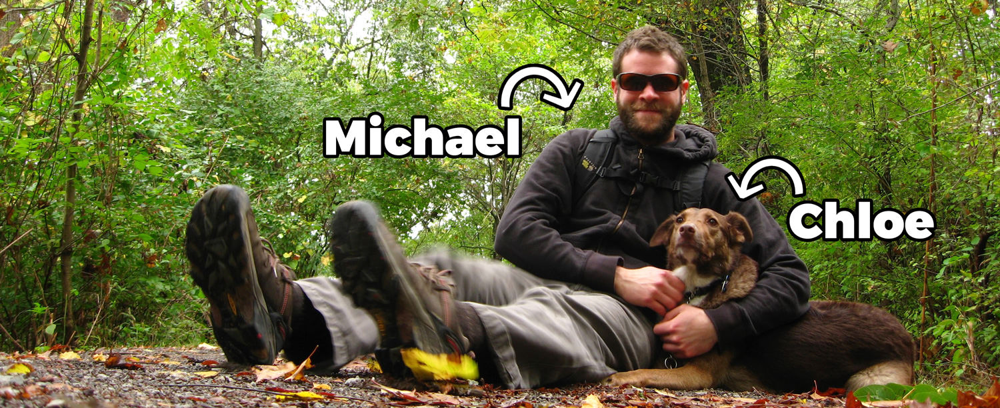

## Hi there 👋
**I'm Michael Edelstone**, a designer living and working remotely in [San Marcos, Texas, USA](https://goo.gl/maps/RF69xpHXDVu), a neat little college town located between Austin and San Antonio in the Central U.S. time zone.

I've been a digital designer [since around 2009](https://github.com/edelstone/my-first-website). Before that I was a pro bicycle mechanic, and before that I worked in movie theaters and managed an independent video store. I went to the University of Pittsburgh and got a degree in History, which taught me how to think critically, but hasn't been super useful otherwise.

I'm a minimalist, and I have an [older dog named Chloe](https://photos.app.goo.gl/dZmnf8guXIF7MCxw1) who I go on adventures with a lot.

- **Personal website:** [michaeledelstone.com](https://michaeledelstone.com)
- **GitHub:** [github.com/edelstone](https://github.com/edelstone)

## Tools I enjoy 🔧
 - **Design:** Chrome DevTools, Sketch, Photoshop, Balsamiq, InVision, paper and pencil
 - **Code:** HTML, CSS, Sass, SVG, UI frameworks, Git, GitHub
 - **Actively learning:** vanilla JavaScript, Principle, React
 - **Productivity:** Things, Evernote, Slack, [Pinboard](https://pinboard.in/u:tsanzer)
 - **Code editor:** Atom
 - **Browser:** Chrome

## Media I consume 📚
 - **Music:** I primarily listen to music on Google Play Music mixed with some ambient backgrounds via [A Soft Murmur](http://asoftmurmur.com/) or [Listen to the Clouds](http://listentothe.cloud/). Good for getting into a zone. My listening stats are on [Last.fm](http://www.last.fm/user/tsanzer).
 - **Podcasts:** I use the Overcast app; it's not perfect but it's the best I've found for iOS. My favorite shows lately are EconTalk, Intelligence Squared, and The Fifth Column.
 - **Reading:** I follow a lot of blogs, scan headlines on Google News, and usually check in with The Economist and Smashing Magazine on a regular basis. I avoid social media for the most part, because it's terrible.
 - **TV:** Some of my favorite series (living or dead) are 30 for 30, Vice Principals, Futurama, Better Call Saul, The IT Crowd, Seinfeld, and Community. I've given up on most of the cable and Netflix series that seem to go on forever.

## Interesting tidbits 🤔
 - I recently lost 75 pounds, and then promptly gained a bunch back. I plan to lose it all again, permanently.
 - [I watch a lot of movies](https://www.imdb.com/list/ls027813782/?sort=date_added,desc&st_dt=&mode=detail&page=1). I'm not proud of all of them – please don't judge me.
 - I lived in Israel for a couple years.
 - [I visit National Parks often](https://drive.google.com/open?id=18UmsEMmCnD-Nw_pzG3fmYnuURfY&usp=sharing). My favorite (so far) is Sequoia National Park with Great Basin in Nevada as a close second.
 - I might move to a remote place or somewhere in the countryside in the near future. I like the quiet.

## Contact me 🤙
Reach out and say hi via [your preferred channel](https://michaeledelstone.com/contact) anytime.

All the best, 
-Michael
